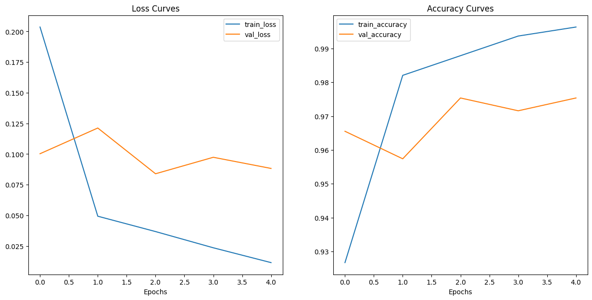

# Chest X-Ray Image Classification with PyTorch

## Overview

This project explores and compares three distinct deep learning methodologies for classifying chest X-ray images into three categories: **COVID-19**, **Normal**, and **Pneumonia**. The primary goal is to determine the most effective approach by building, training, and evaluating each model on a public dataset from Kaggle.

The three implemented approaches are:
1.  A **Custom CNN** built from scratch.
2.  **Feature Extraction** using a pre-trained ResNet-18 with frozen convolutional layers.
3.  **Fine-Tuning** a pre-trained ResNet-18 by unfreezing all layers and training with a low learning rate.

The project was developed entirely in **PyTorch**, without the use of high-level frameworks like Keras, to demonstrate a deeper understanding of the model training lifecycle.

## Key Results

After a series of experiments and hyperparameter tuning for each approach, the **Fine-Tuning** methodology proved to be the most effective, achieving the highest performance on the test set.

| Model | Accuracy | Precision (Macro) | Recall (Macro) | F1-Score (Macro) |
| :--- | :---: | :---: | :---: | :---: |
| Custom CNN | 0.9581|	0.9566|	0.9554|	0.9553|
| Feature Extraction | 0.9348|	0.9400|	0.9174|	0.9280|
| **Fine-Tuning (ResNet-18)** |  **0.9658**|	**0.9714**	|**0.9453**|	**0.9578**|

### Learning Curves of the Best Model (Fine-Tuning)

## Analysis & Discussion

The final results confirm that adapting pre-existing knowledge to a new domain is a powerful strategy.

-   The **Custom CNN** performed remarkably well, achieving **95.11% accuracy**. It showed signs of overfitting on the training data, but this did not harm its ability to generalize, as evidenced by its high and stable validation performance.

-   The **Feature Extraction** model was the least performant at **93.94% accuracy**. This is likely due to a "domain mismatch," where the high-level features learned on the ImageNet dataset were not perfectly suited for the specific patterns found in medical X-ray imagery.

-   The **Fine-Tuning** model was the clear winner at **96.51% accuracy**. By allowing all layers of the pre-trained ResNet-18 to be updated with a low learning rate, the model was able to adapt its powerful, generalized feature detectors to the specific nuances of the X-ray dataset. This approach achieved the best balance of leveraging prior knowledge and specializing in the task at hand.

In a medical context, metrics like **Recall** (the model's ability to find all actual positive cases) and **Precision** (the reliability of the model's positive predictions) are critical. The fine-tuned model excelled in these areas, demonstrating its potential for reliable classification.

## Future Improvements

While the results are highly satisfactory, performance could potentially be further improved by:
-   Augmenting the training dataset with more data.
-   Experimenting with more complex pre-trained architectures, such as DenseNet or EfficientNet.
-   Utilizing ensembling techniques, which combine the predictions of multiple models for a more robust final decision.

## How to Run

This project was developed in a Google Colab environment. The notebook is self-contained and handles the dataset download automatically using the Kaggle API. To run it, simply open the `.ipynb` file in Google Colab and execute the cells from top to bottom.

---

Project by **Vitor Petri Silva**
